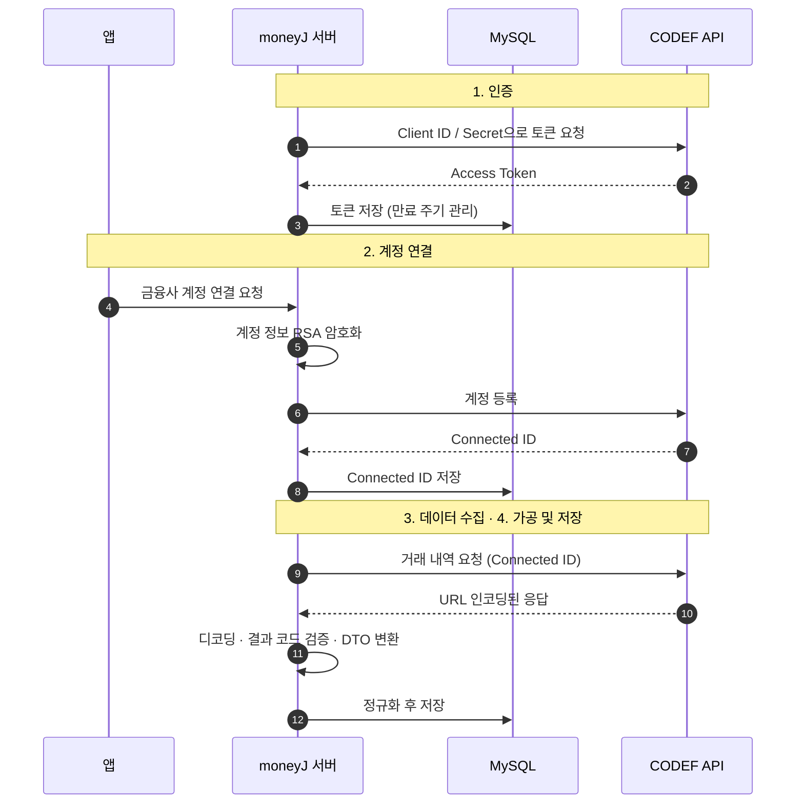

<br>
<br>

> 건강한 저축 습관 형성을 위한 소비 패턴 기반 여행 저축 가이드 서비스

## Core Contributions (핵심 기여도)

### 1. 금융 데이터 연동 파이프라인 구축
  - CODEF API를 활용하여 은행 계좌 및 카드 거래 데이터를 수집하는 데이터 파이프라인 설계.
  - CODEF가 요구하는 RSA 암호화와 API 응답 디코딩 로직 구현.

### 2. 그룹 여행·공동 저축 API 설계
  - 다수의 사용자가 함께 참여하는 공동 여행 플랜 및 그룹 저축 시스템의 핵심 API 설계 및 구현.
  - 그룹 예산 산출 로직과 상태 관리 구현.

<br>

## 2. 개발 환경
### Language 


### Framework & Runtime


### ORM (Object-Relational Mapping)


### Database


### Infra & Cloud 서비스 (AWS)


### External Services & AI


### DevOps & CI/CD


### Monitoring


<hr>

## 3-1. 소프트웨어 아키텍처


<br>
<br>

본 시스템은 사용자의 금융 데이터 통합 관리 및 AI 기반 맞춤형 자산 분석 기능을 제공하는 'moneyJ' 서비스의 백엔드 아키텍처로 설계되어 있습니다. <br>
각 도메인(계좌, 카드, 거래, 여행 등)은 역할에 따라 모듈 단위로 분리되어 있으며, Spring Boot의 계층형 아키텍처를 통해 <br>
비즈니스 로직의 독립성과 유지보수성을 보장합니다. 외부 금융 API인 CODEF와의 연동을 통해 자산 정보를 수집하고, <br>
OpenAI LLM을 활용한 소비 진단 및 여행 예산 가이드를 제공하는 것이 특징입니다. 전체 시스템은 Docker 기반의 <br>
컨테이너 환경에서 운용되며, Prometheus로 시스템 지표를 모니터링합니다. <br>


| 서비스명               | 설명                                                     |
| ------------------ | ------------------------------------------------------ |
| **인증 및 보안 서비스**  | 카카오 OAuth2 소셜 로그인 연동 및 JWT 기반의 보안 인증/인가 처리                        |
| **금융 계정 관리 서비스**     | 은행 계좌 및 카드 정보의 연결, 동기화, 상태 관리를 담당하는 서비스                 |
| **거래 내역 관리 서비스**         | 거래 내역 수집 및 소비 데이터의 저장, 조회 및 동기화 스케줄링 수행      |
| **금융 API 연동 서비스 (Codef)**         | 외부 금융망(CODEF)과의 인터페이스를 담당하며 인증 토큰 및 API 통신 제어 |
| **AI 분석 및 진단 서비스** | 거래 데이터를 분석하고 OpenAI와 연동하여 맞춤형 절약 팁 및 소비 요약 생성             |
| **여행 및 예산 관리 서비스**      | 여행 일정별 예산 수립 및 AI 기반의 여행 경비 가이드 제공                |
| **사용자 정보 관리 서비스**      | 회원 프로필 관리 및 애플리케이션 내 사용자 기반 정보 관리                       |
| **공통 인프라 모듈**  | 전역 예외 처리(Exception), QueryDSL 설정, 비동기 처리 등 시스템 공통 기능 제공             |
| **모니터링 및 운영**         | Prometheus를 통한 시스템 지표 추적 및 Docker 기반 컨테이너 인프라 관리              |


<br>

### 3-2. 시스템 아키텍처
서비스 전반은 Docker로 컨테이너화되어 AWS EC2에서 운영됩니다. <br>


<br>

<hr>

## 4. Technical Achievements

### 4-1. CODEF API
**External Financial Data Pipeline (CODEF API)** <br>
금융 서비스의 핵심은 신뢰할 수 있는 데이터를 안전하게 가져오는 것입니다. 이를 위해 CODEF API를 활용하여 사용자의 은행/카드 데이터를 수집하는 전용
파이프라인을 구축하였습니다.

<br>

**파이프라인 개요**
- 보안: CODEF가 요구하는 RSA-2048 암호화로 사용자 민감 정보(계정 정보 등)를 보호
- Connected ID 체계: 일회성 인증이 아닌, 지속적인 데이터 수집을 위한 고유 식별자 관리
- 정규화 및 디코딩: API 응답 데이터를 서비스 도메인 모델로 변환하는 전용 디코더 구현

<br>

**핵심 데이터 구성**

| 요소 | 설명 |
| :--- | :--- |
| **CODEF Access Token** | API 호출을 위한 2단계 인증 토큰 (DB 저장 및 만료 주기 관리) |
| **Connected ID** | 사용자의 금융 기관 계정과 1:1 매핑되는 고유 식별 코드 |
| **RSA Encryption** | 암호, 계좌번호 등 민감 데이터 전송 시 적용되는 비대칭키 암호화 방식 |
| **Response Decoding** | URL 인코딩된 금융 응답 데이터를 디코딩해 DTO로 변환 |

<br>

**데이터 연동 흐름도** 


1. 인증 단계 (OAuth 2.0): 서비스 서버와 CODEF API 간의 Client ID/Secret 기반 토큰 발급
2. 계정 연결 단계 (Connected ID): 사용자 금융 인증 정보를 RSA 암호화하여 전송 후 고유 ID 발급 및 저장
3. 데이터 수집 단계 (Scraping): 저장된 Connected ID를 사용하여 은행/카드사의 거래 내역 요청
4. 가공 및 저장 단계 (Decoding): 응답 데이터를 디코딩하고, 서비스 요구사항에 맞춰 정규화 후 DB 반영
   
---

**1단계: 보안 전송을 위한 RSA 암호화** 
사용자의 금융 계정 정보는 매우 민감하므로, CODEF에서 요구하는 RSA 암호화 방식을 적용하였습니다.

(RsaEncryptor.java)
``` java
public class RsaEncryptor {

    @SneakyThrows
    public static String encryptWithPemPublicKey(String plain, String pem) {

        String base64 = pem.replace("-----BEGIN PUBLIC KEY-----", "")
                .replace("-----END PUBLIC KEY-----", "")
                .replaceAll("\\s", "");

        byte[] der = Base64.getDecoder().decode(base64);

        PublicKey key = KeyFactory.getInstance("RSA")
                .generatePublic(new X509EncodedKeySpec(der));

        Cipher cipher = Cipher.getInstance("RSA/ECB/PKCS1Padding");
        cipher.init(Cipher.ENCRYPT_MODE, key);

        byte[] enc = cipher.doFinal(plain.getBytes(java.nio.charset.StandardCharsets.UTF_8));

        return Base64.getEncoder().encodeToString(enc);
    }
}
```
- 역할: 사용자 비밀번호 및 인증 정보를 CODEF 서버로 전송하기 전 암호화
- 특징: CODEF 규격에 맞춰 RSA/ECB/PKCS1Padding 적용

<br>

**2단계: API 통신 및 응답 처리** (API Client)

외부 API 오류에 대응하기 위해 공통 API 클라이언트를 구축하고, 응답 형식을 처리하는 디코더를 구현했습니다.

(ApiResponseDecoder.java)
```java
@Slf4j
public class ApiResponseDecoder {

    private static final ObjectMapper objectMapper = new ObjectMapper()
            .configure(DeserializationFeature.ACCEPT_SINGLE_VALUE_AS_ARRAY, true);

    /**
     * URL 인코딩된 응답을 디코딩하고 지정된 DTO 타입으로 파싱
     */
    public static <T> T decode(String encodedResponse, TypeReference<T> typeReference) {
        // (입력값 검증 생략)

        try {
            // 1. URL 디코딩 (StandardCharsets.UTF_8)
            String decodedJson = URLDecoder.decode(encodedResponse, StandardCharsets.UTF_8);

            // 2. Jackson ObjectMapper를 이용한 객체 매핑
            return objectMapper.readValue(decodedJson, typeReference);

        } catch (Exception e) {
            log.error("API 응답 디코딩 또는 파싱 실패", e);
            throw MoneyjException.of(CodefErrorCode.PARSING_ERROR);
        }
    }

    // (Map 형태의 범용 디코딩 메서드 오버로딩 생략...)
}
```

- 역할: URL 인코딩된 응답 데이터를 디코딩하고 JSON을 도메인 DTO로 변환
- 특징: 응답 코드(CF-00000 등)에 따른 세분화된 예외 처리

<br>

---

### 4-2. CODEF API 트러블슈팅: 구조 개선

### 기존 구조의 문제점

1. @Transactional이 적용된 하나의 거대한 클래스(God Class) 내에서 외부 API 호출과 DB 저장이 동시에 발생. 외부 API 지연 시 DB 커넥션 풀이 고갈될 위험이 존재.

2. 도메인과 외부 인프라의 강한 결합

3. 계좌 하나를 연동하기 위해 클라이언트(프론트엔드)가 백엔드로 3번 연속 API를 호출해야 하는 무거운 구조.

4. API 응답을 Map<String, Object>로 받아 하드코딩으로 파싱


### 핵심 개선 사항

<br>

**외부 API 통신과 DB 트랜잭션의 분리**

거대 클래스를 역할에 따라 3개의 계층으로 분리
  
| 클래스명 | 주요 역할 | 트랜잭션 (@Transactional) | 특징 및 의존성 |
| :--- | :--- | :---: | :--- |
| **CodefCredentialFacade** | 전체 흐름 제어 (Orchestration) | 미적용 | 서비스와 API 호출자 사이의 로직 조율 |
| **CodefCredentialApiCaller** | 외부 API 통신 및 데이터 파싱 | 미적용 | **DB 의존성 없음**, 외부 통신 및 데이터 가공 전담 |
| **CodefInstitutionService** | DB 저장 및 영속성 관리 | **적용** | DB CRUD 및 데이터 정합성 보장 |

<br>

**WebClient 기반 공통 통신 모듈 표준화**

여러 외부 API(CODEF, OpenAI) 연동 과정에서 팀원마다 서로 다른 통신 방식(RestTemplate vs WebClient)을 혼용하여 코드 일관성과 유지보수성이 저하.
이를 해결하고자 WebClient를 래핑한 공통 API Client를 만들어 팀 내 표준 통신 모듈로 정착. 외부 연동 결과를 바로 저장해야 하므로 호출은 block()으로 동기 처리.

```java
@Component
@RequiredArgsConstructor
public class CodefApiClient {

    private final WebClient codefWebClient;
    private final CodefAuthService codefAuthService;

    /**
     * 외부 API와 실제 통신 수행
     */
    public String executePost(String url, Object body) {
        String token = codefAuthService.getValidAccessToken();

        return codefWebClient.post()
                .uri(url)
                .header(HttpHeaders.AUTHORIZATION, "Bearer " + token)
                .bodyValue(body)
                .exchangeToMono(resp -> {
                    // 응답 상태(4xx, 5xx)에 따른 로깅 및 처리 생략...
                    return resp.bodyToMono(String.class).defaultIfEmpty("");
                })
                .block(); // 외부 연동의 정합성을 위해 동기 처리
    }

    /**
     * 2. 응답 파싱 + 비즈니스 검증 공통화
     * @param <T> 기대하는 데이터 모델 타입
     */
    public <T> T fetchAndDecode(String url, Object body, TypeReference<CodefResponseDTO<T>> typeReference) {

        // 1) API 호출 (Raw 데이터 획득)
        String rawResponse = executePost(url, body);

        // 2) JSON 파싱 (Generic 대응)
        CodefResponseDTO<T> responseDTO = ApiResponseDecoder.decode(rawResponse, typeReference);

        // 3) 비즈니스 에러 검증 (CODEF 결과 코드가 '성공'인지 확인)
        if (responseDTO == null || !responseDTO.result().isSuccess()) {
            throw MoneyjException.of(CodefErrorCode.BUSINESS_ERROR);
        }

        return responseDTO.data(); // 최종 정제된 데이터 반환
    }
}
```

<br>

**ACL(Anti-Corruption Layer)과 Adapter 패턴 도입**

외부 시스템의 변경이 핵심 도메인을 오염시키지 않도록 **ACL(부패 방지 계층)**을 구축.

도메인 계층에는 CardProvider 등 순수 인터페이스(Port)만 정의.

인프라 계층의 CodefCardAdapter가 이를 구현하며, 외부 API 데이터를 우리 서비스만의 표준 DTO(ExternalAccountDTO)로 번역하여 전달.

<br><br>

**클라이언트 네트워크 비용 감소 및 명령·조회 분리**

API 통합: 클라이언트가 3번 호출하던 연동 프로세스(ID발급 → 기관등록 → 조회)를 2번으로 줄여 클라이언트의 부담을 줄이고 응답 속도를 개선.

명령과 조회 분리(CQS): 조회와 DB 저장이 혼재되어 있던 기존 메서드를 순수 조회(fetchCards)와 저장(linkCard) 명령으로 분리하여 사이드 이펙트를 차단.

<br>

**DTO 기반의 데이터 파싱 구현**

불안정한 Map 파싱을 걷어내고 공통 응답 DTO를 구축.

CODEF API 특유의 가변적인 응답 규격(성공 시 배열, 실패 시 객체 반환)을 처리하기 위해 Jackson의 ACCEPT_SINGLE_VALUE_AS_ARRAY 옵션을 적용한 커스텀 디코더(ApiResponseDecoder)를 구현하여 타입 안정성을 확보.

<br>

### 결과

- 안정성 및 확장성 확보: 외부 API 지연이 DB 커넥션 점유로 번지지 않는 구조를 만들었고, 금융 데이터 제공자가 바뀌어도 Adapter만 추가하면 되는 기반을 마련.

- 예측 가능한 코드: 객체의 책임을 명확히(SRP) 분리하고 Facade 패턴을 도입함으로써, 메서드 이름만 보고도 동작을 예측할 수 있는 유지보수성 향상.

<br>

---

### 4-3. CODEF API 트러블슈팅: HTTP 200 안에 숨은 인증 실패

**문제**

금융사 비밀번호를 바꾼 뒤에도 시스템이 이전 자격증명으로 CODEF API를 계속 호출해, 개발 중 제 은행 계정이 반복해서 잠겼습니다. 응답은 매번 HTTP 200이었고, 시스템은 이를 정상 응답으로 처리하고 있었습니다.

**원인**

요청부터 비즈니스 로직까지 흐름을 단계별로 추적해, CODEF가 인증 실패를 HTTP 상태 코드가 아니라 응답 본문의 errorList에 담아 보낸다는 것을 확인했습니다. 상태 코드만 보고 성공 여부를 판단한 것이 원인이었습니다.

**해결**

- 상태 코드와 응답 본문의 결과 코드, 에러 필드를 함께 검증하도록 바꿨습니다. 위 CodefApiClient의 fetchAndDecode에서 결과 코드를 확인하는 부분이 이 검증입니다.
- 비밀번호 불일치가 감지되면 연동 상태를 갱신해, 잘못된 자격증명으로 다시 호출하지 않도록 했습니다.

**결과**

잘못된 자격증명의 반복 호출을 차단했고, 이후 계정 잠금은 재발하지 않았습니다.


<hr>
